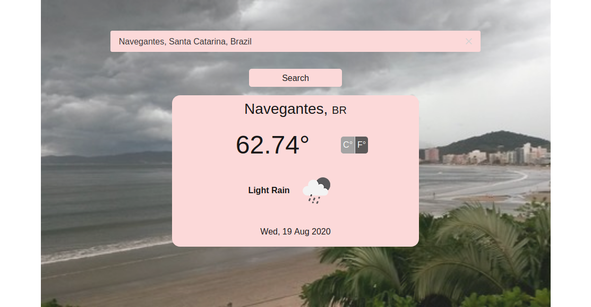

[![Contributors][contributors-shield]][contributors-url]
[![Forks][forks-shield]][forks-url]
[![Stargazers][stars-shield]][stars-url]
[![Issues][issues-shield]][issues-url]

# Weather API

On this project, I created an app to get the weather information. You just search the city and it will return the weather on that location. It uses OpenWeather API to get the weather information, Flickr API to get images and Algoria API to return a list of cities to autocomplete on the Search.



## Table of Contents

* [Features](#features)
* [Live Demo](#demo)
* [Installation](#installation)
* [Built With](#built-with)
* [Contributing](#contributing)
* [Acknowledgments](#acknowledgments)
* [Authors](#author)
* [License](#license)

## Features

- The app can switch between Celsius or Fahrenheit degrees
- It will return as a background image, some image that was taken around the city it is searching (using Flickr API for it)
- It suggests cities on search (using Algoria API for it)
- When there is no return for the weather API it handles the error showing a message

## Demo

[Live Demo](https://raw.githack.com/Stricks1/weatherApp/feature-api/dist/index.html)

## Installation

You can get a local copy of the repository please run the following commands on your terminal:
```
$ cd <folder>
$ git clone git@github.com:Stricks1/weatherApp.git
```

## Built With
- Javascript
- HTML
- CSS
- Webpack
- Open Weather API

## Contributing

Contributions, issues and feature requests are welcome!

You can do it on [issues page](issues/).

## Acknowledgments

Special thanks to code reviewers.

## Show your support

Give a ⭐️ if you like this project!

## Author

👤 **Gabriel Malheiros Silveira**

- Github: [@Stricks1](https://github.com/Stricks1)
- Linkedin: [Gabriel Silveira](https://linkedin.com/in/gabriel-malheiros-silveira/)
- Twitter: [@Gabriel_Stricks](https://twitter.com/Gabriel_Stricks)

## License

<strong>Creative Commons 2020</strong>

<!-- MARKDOWN LINKS & IMAGES -->

[contributors-shield]: https://img.shields.io/github/contributors/stricks1/weatherApp.svg?style=flat-square
[contributors-url]: https://github.com/stricks1/weatherApp/graphs/contributors
[forks-shield]: https://img.shields.io/github/forks/stricks1/weatherApp.svg?style=flat-square
[forks-url]: https://github.com/stricks1/weatherApp/network/members
[stars-shield]: https://img.shields.io/github/stars/stricks1/weatherApp.svg?style=flat-square
[stars-url]: https://github.com/stricks1/weatherApp/stargazers
[issues-shield]: https://img.shields.io/github/issues/stricks1/weatherApp.svg?style=flat-square
[issues-url]: https://github.com/stricks1/weatherApp/issues